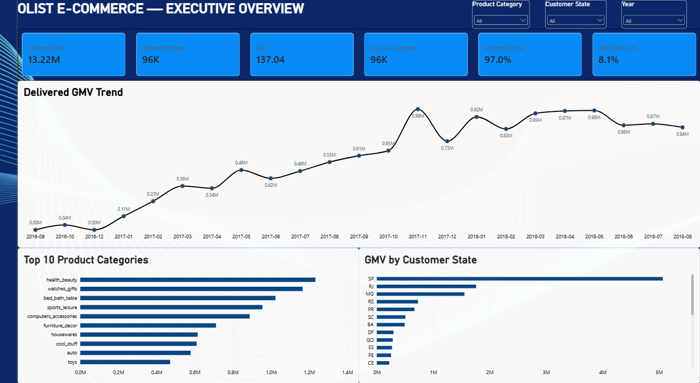
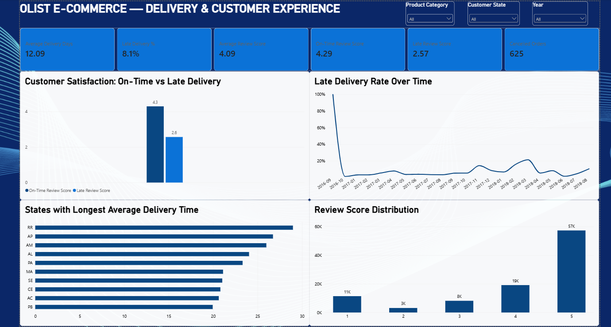
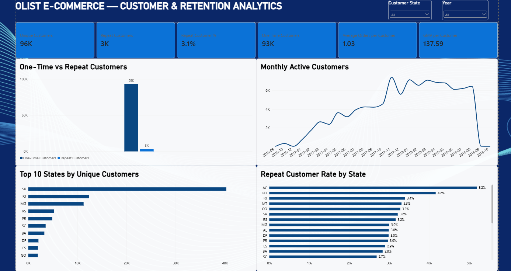
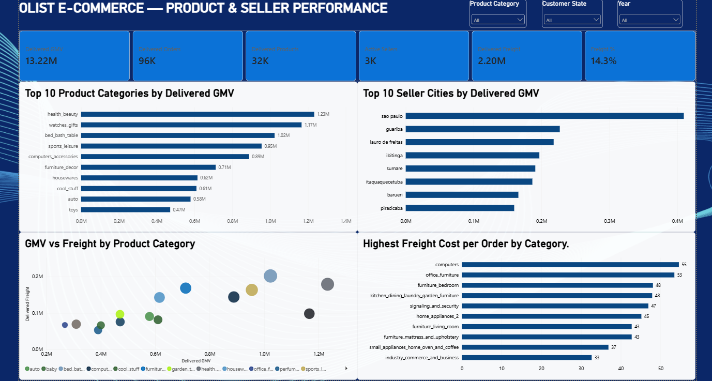

# Olist E-Commerce Analytics

Power BI project built on the public Olist Brazilian e-commerce dataset.

The report focuses on commercial performance, delivery quality, customer retention, product performance, seller performance, and freight cost.

## Dashboard pages

### Executive Overview



Main KPIs:
- Delivered GMV: 13.22M BRL
- Delivered Orders: ~96K
- AOV: 137.04 BRL
- Unique Customers: ~96K
- Delivery Rate: 97.0%
- Late Delivery Rate: 8.1%

The page also shows monthly GMV, top product categories, and GMV by customer state.

### Delivery & Customer Experience



This page compares on-time and late deliveries, review scores, delivery time, cancellations, and review-score distribution.

A clear pattern in the data is the difference in review scores between on-time and late orders:
- On-time review score: 4.29
- Late-delivery review score: 2.57

### Customer & Retention Analytics



This page looks at customer activity and repeat purchasing.

Main measures:
- Unique Customers: ~96K
- Repeat Customers: ~3K
- Repeat Customer Rate: 3.1%
- One-Time Customers: ~93K
- Average Orders per Customer: 1.03

### Product & Seller Performance



This page covers product categories, seller locations, freight cost, and category-level GMV.

It includes:
- top product categories by delivered GMV
- top seller cities by delivered GMV
- GMV vs freight by product category
- highest freight cost per order by category

## Data model

The report combines:
- orders
- order items
- customers
- products
- sellers
- payments
- reviews
- a dedicated Date table

Payments and reviews are kept at their own grain instead of being merged into the order-item table. This avoids duplicating payment or review values when an order contains multiple items.

## Data preparation

Power Query was used for:
- data types and date handling
- delivery-day calculation
- late-delivery flag
- product-category translation
- customer and seller geolocation enrichment
- product metadata cleanup
- order-line value calculation

## DAX

The report includes measures for:
- delivered orders
- GMV
- freight
- AOV
- delivery rate
- late-delivery rate
- average delivery days
- review scores
- repeat customers
- MoM and YoY GMV
- cancellation rate
- category-level freight and order measures

The main measure definitions are in `docs/dax_measures.txt`.

## Files

```text
Olist_Ecommerce_BI_Analytics.pbix
README.md
docs/
  dax_measures.txt
  power_query_notes.md
sql/
  analysis.sql
screenshots/
  01_executive_overview.png
  02_delivery_customer_experience.png
  03_customer_retention_analytics.png
  04_product_seller_performance.png
theme/
  olist_theme.json
```

## Dataset

Public Olist Brazilian E-Commerce dataset.

This is a portfolio project based on public anonymized data.
